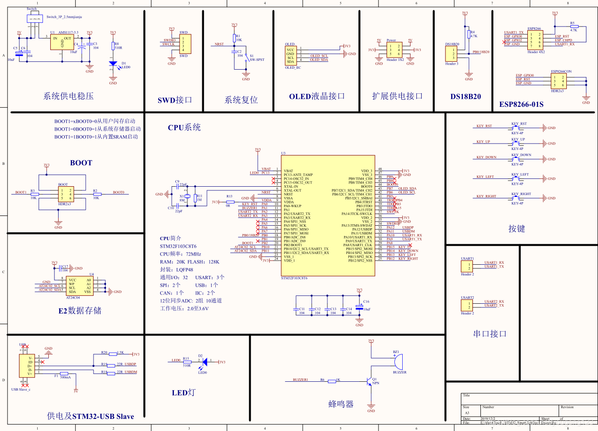
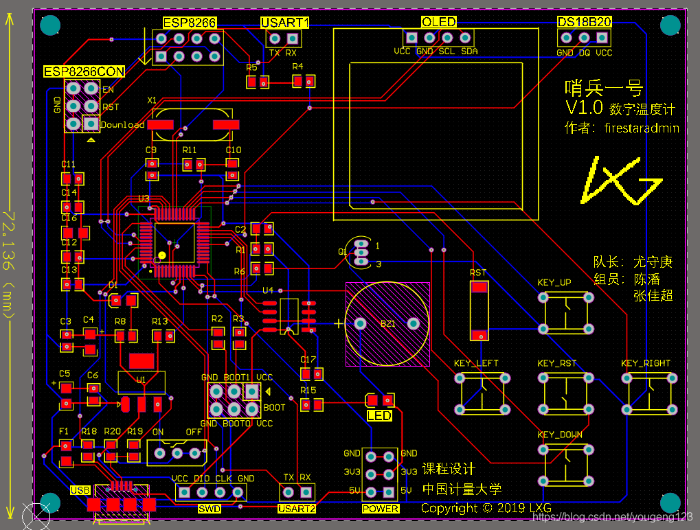

# STM32数字网络温度计    ShaoBing-No.1
 ***本项目所有源码文件包括原理图PCB已开源到GitHub上	供大家学习讨论-> [ShaoBing-No.1](https://github.com/firestaradmin/ShaoBing-No.1)***
 ***视频实况已上传至BiliBili  [点我观看](https://www.bilibili.com/video/av80249560)***

---

## 项目概括
- **项目简介：stm32项目，时间片论询结构，驱动OLED显示温度历史曲线，具备物联网功能发送数据至手机APP，可PI计算输出控制温度方案**
- 

- **项目起因：**
&nbsp;&nbsp;&nbsp;&nbsp;大学专业课程设计，需设计一款基于DS18B20 的数字温度计

	

- **项目要求：**
    1. 实现测温范围 -5~125℃，误差+-0.1℃
	2. 实时采集温度数据，并实时显示记录温度曲线
	3. 设置控制的期望值范围，超出范围则声光报警
- **扩展要求：**
	4. 可与计算机进行通讯 ，可上传温度数据
	5. 具有PI控制算法，可计算输出值
	6. 具有物联网功能，将数据传递至服务器，手机显示温度曲线 基于ESP8266-01S
	7. 位式或连续温度调节
	
- **项目器件：**
	1. STM32F103C8T6 主控芯片*1
	2. DS18B20 测温*1
	3. OLED_IIC 屏幕*1
	4. ESP8266-01S WIFI模块*1
	5. LED灯
	6. 蜂鸣器
	7. etc..

---
## 项目实现


​		

### 1. 原理图设计:
&nbsp;&nbsp;&nbsp;&nbsp;首先进行原理图设计，基于最基础的STM32F103C8T6芯片，将需要用到的元器件模块等等，连接至主控。 		
具体可以参考以下原理图。(如有错误请指正 谢谢)



### 2. PCB设计：
&nbsp;&nbsp;&nbsp;&nbsp;将原理图画成PCB文件，并找一个商家发板。
&nbsp;&nbsp;&nbsp;&nbsp;每次发板子，等待都是漫长的过程。但是还好，嘉立创每月可以发两次5元的板子，算是对学生和工程师的优惠了
&nbsp;&nbsp;&nbsp;&nbsp;PCB设计如下：(如有错误请指正 谢谢)


### 3. Code 代码部分
&nbsp;&nbsp;&nbsp;&nbsp;板子到手后，就急急忙忙的焊完了，通电测试正常后，开始编写程序。
- 程序部分分为两块：主控STM32的程序和ESP8266-01S的固件
    	主控采用Keil编写，ESP采用Arduino编写，因为Arduino的Wifi库真的很好用。

#### STM32F103主控部分：
&nbsp;&nbsp;&nbsp;&nbsp;主控的思路基本就是，一个循环里做各任务的调用，如按键扫描键值处理，屏幕的动态更新，等等
每个任务都是采用Void形式，不返回数值，全部使用全局变量的标志来实现各函数间的通讯信息传递。
这样的好处就是不会阻塞程序的运行，使得程序的每一个部分都会被执行到。与RTOS等时间片论相比
就有那味儿了！！
&nbsp;&nbsp;&nbsp;&nbsp;主控部分我的大部分精力都花在了OLED的刷新速率优化和按键处理上

&nbsp;&nbsp;&nbsp;&nbsp;OLED最后采用硬件IIC + DMA 的行为传送，在主控RAM里模拟一个1024B的显存，每次显存有变化则刷新至OLED，以OLED-IIC 400Kpbs的速率下，刷新整屏幕只需要 *0.02332s* 理论上刷新率可以达到42帧，而采用DMA传输，还不浪费CPU的资源。

&nbsp;&nbsp;&nbsp;&nbsp;主循环中的进程主要有下面四个

```c
		//while(1)主循环里 顺序执行以下进程，进程基本无阻碍，使用全局变量消息传递机制，可保证实时性。
		myKey_GetKeyValue();//获取键值
		app_Handle_KeyState();//键值处理
		app_Updata_Interface();//界面更新
		app_Dynamic_Display();//动态显示
```
&nbsp;&nbsp;&nbsp;&nbsp;先硬件层上，中断处理按键，是否有按键按下，然后调用

```c
myKey_GetKeyValue();//获取键值
```
根据按下的时间更新按键消息。再根据按键消息来执行各个函数功能。
具体按键处理机制，可以参考我的另一篇博客   *[STM32按键处理机制](https://blog.csdn.net/yougeng123/article/details/103733592)*

&nbsp;&nbsp;&nbsp;&nbsp;之后是界面更新函数进程和动态更新函数进程。
界面更新函数进程主要根据当前页面序号与上次页面序号是否相同，来决定是不是要更新界面，具体定义如下：

```c
//界面显示
typedef enum 
{
	No_Interface = 256,
	Main_Interface = 0,
	Menu_Interface = 1,
	Menu_ENTER_Interface = 2,
	Input_Interface = 3
}Interface_Num_enumTypedef;//页面序号定义

Interface_Num_enumTypedef now_Interface_Num = No_Interface ; 	//当前的页面序号
Interface_Num_enumTypedef next_Interface_Num = Main_Interface;	//下次需要更新到的页面序号
```
页面静态更新函数：
```c
//静态显示 aka 静态页面更新进程
void app_Updata_Interface()
{
	if(now_Interface_Num != next_Interface_Num)
	{
		OLED_RamClear();
		switch (next_Interface_Num)
		{
			case Main_Interface:
				OLED_ShowBMP(0,0,127,63, (u8 *)Interface_Main);
				now_Interface_Num = Main_Interface;
				break;
			case Menu_Interface:
				OLED_ShowBMP(0,0,127,63, (u8 *)Interface_Menu);
				now_Interface_Num = Menu_Interface;
				break;
			case Menu_ENTER_Interface:
				OLED_ShowBMP(0,0,127,63, (u8 *)MENU_ENTER_INTERFACE);
			············省略
```
动态更新每一个主循环进行一次，就会动态更新一次，以便于显示按键动画，温度曲线等动态效果。当处于哪个页面就会更新相应的效果，具体应用具体设计。篇幅过大就不贴出来了。源码已上传至Github

&nbsp;&nbsp;&nbsp;&nbsp;那么界面显示最主要的还是OLED的驱动显示，OLED驱动好了，更新速率上去了，动画才会更加流畅。可以参考   *[ STM32 DMA-IIC刷新OLED屏(理论可达42+帧率)](https://blog.csdn.net/yougeng123/article/details/103734303)*


#### ESP8266-01S部分：
&nbsp;&nbsp;&nbsp;&nbsp;ESP的程序相对来说简单了很多，需要做的只是连接WIFI然后串口接受温度数据，并HTTP-POST请求上传数据置服务器即可。（其实可以做的复杂点，就是自己设计一个通讯协议，这样通讯更严谨，但由于时间问题，就草草的设计了简单的通讯，无帧头帧尾和校验位）

&nbsp;&nbsp;&nbsp;&nbsp;//本来打算加个选择连接WIFI的功能，并且增加软键盘输入密码等功能，但是学期末了，时间不太够了，想想觉得很麻烦，就算了，直接将WIFI名和密码写在了程序里。

&nbsp;&nbsp;&nbsp;&nbsp;ESP的程序编写用到了Arduino的ESP8266的库，网上可以下载到，也可以到我的GitHub上下载。

&nbsp;&nbsp;&nbsp;&nbsp;思路：先连接WIFI  然后一直循环在串口接收的函数里，判断是否有正确的温度数据被接受，有则POST请求至服务器

```cpp
char* getValue()
{
  while (true)
  {
    if (Serial.available() > 0)
    {
      inByte = Serial.read();
      //Serial.print(inByte);
      if (inByte == '[')
      {
        isCommand = true;
        rxBuffer_tail = 0;
        //rxBuffer[0] = 0;
      }
      else if (inByte == ']')
      {
        isCommand = false;
        rxBuffer[rxBuffer_tail] = '\0';
        return rxBuffer;
      }
      else if (isCommand)
      {
        rxBuffer[rxBuffer_tail++] = inByte;
      }
    }
  }
}
```
&nbsp;&nbsp;&nbsp;&nbsp;具体代码已开源至GitHub。


@firestaradmin